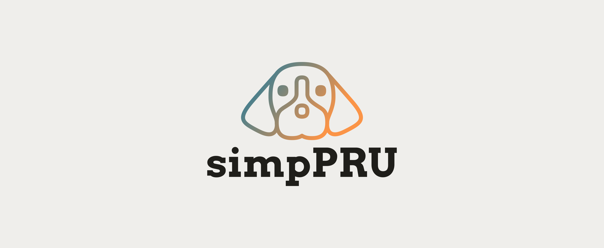

<br />
<p align="center">
  <a href="https://github.com/VedantParanjape/simpPRU">
    
  </a>

  <h3 align="center">simpPRU</h3>

  <p align="center">
    Intuitive language for PRU which compiles down to PRU Assembly.
    <br/>
    <br/>
    <a href="https://github.com/VedantParanjape/simpPRU/"><strong>Explore the docs »</strong></a>
    <br />
    <a href="https://github.com/VedantParanjape/simpPRU/issues">Report Bug</a>
    ·
    <a href="https://github.com/VedantParanjape/simpPRU/issues">Request Feature</a>
    ·
    <a href="https://github.com/VedantParanjape/simpPRU/pulls">Send a Pull Request</a>
  </p>
</p>

<p align="center">


</p>

## Details

***GSoC 2020*** project under BeagleBoard.org

* Name: Vedant Paranjape
* Wiki: <https://elinux.org/BeagleBoard/GSoC/2020_Projects/PRU_Improvements>
* Progress log: <https://ve0x10.me/gsoc2020/>
* Mentors: Abhishek Kumar, Pratim Ugale, Andrew Henderson  
* Organisation: BeagleBoard.org

## Build

Requirements:

* flex
* bison
* gcc
* pru-gcc

```bash
mkdir build
cd build
cmake ..
make 
sudo make install

# build debian package
sudo make package

# install debian package
sudo dpkg -i <debian_package_name>.deb
```

## Install

Download debian package from Releases, available for amd64 and arm32 arch

```bash
sudo dpkg -i <debian_package_name>.deb
```

Check `/examples` for different examples

## To Do List

* [ ] Add support for AM57xx systems (BeagleBone AI)
* [ ] Add support for using PWM using eCAP module
* [ ] Implementing helper programs to simplify the process of loading PRU firmware
* [ ] Writing documentation
