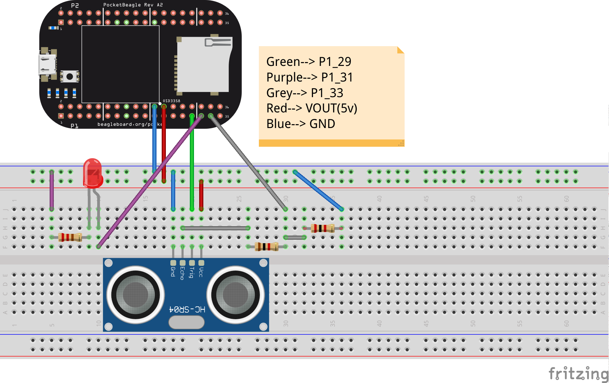
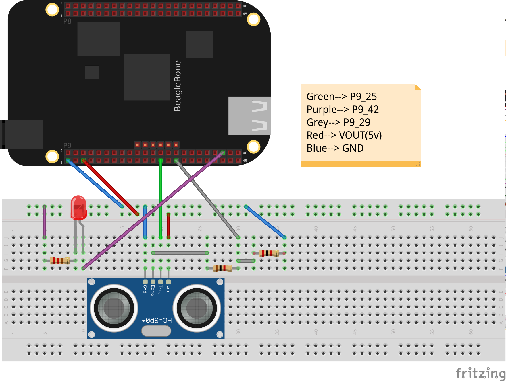

# HCSR04 Distance Sensor example (sending distance data to ARM using RPMSG)

!!! info "Schematic"
    === "Pocket Beagle"
           

    === "BeagleBone Black / Beagle Bone Black Wireless"
           

## Code

```python
def measure : int : {
    bool timeout := false;
    int echo := -1;

    start_counter();
    
    while : read_counter() <= 2000 {
        digital_write(5, true);
    }
    digital_write(5, false);
    stop_counter();

    start_counter();
    while : not (digital_read(6)) and true {
        if : read_counter() > 200000000 {
            timeout := true;
            break;
        }
    }   
    stop_counter();
    
    if : not(timeout) and true {
        start_counter();
        while : digital_read(6) and true {
            if : read_counter() > 200000000 {
                timeout := true;
                break;
            }
            echo := read_counter();
        }
        stop_counter();
    }
    
    if : timeout and true {
        echo := 0;
    } 

    return echo;
}

init_message_channel();

while : true {
    int ping:= measure();

    send_message(ping);
    delay(1000);
}
```

* Following code works on PocketBeagle, to use on other boards, please change the pins accordingly.

## Explaination