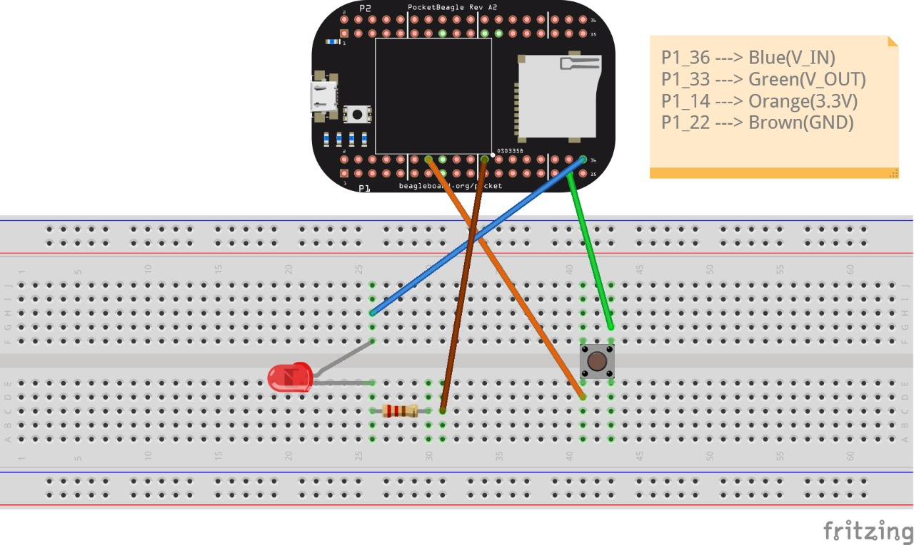

# Ring Testing example

!!! info "Schematic"
    === "Pocket Beagle"
        


## Code

```python
while : true
{
if: digital_read(P1_33)
{
    digital_write(P1_36, true);
}
else
{
    digital_write(P1_36, false);
}
}
```

* This is the code for ring-testing with simpPRU on PocketBeagle,the pinout giving works well for this.

## Explaination
The above code is in simpPRU which is equivalent to [PRU C](https://github.com/beagleboard/cloud9-examples/blob/v2020.01/PocketBeagle/pru/ring.pru0.c).

This code runs a never ending loop, since it is `while : true`. 
Inside `while` it reads header pin P1_33, it checks if header pin P1_33 is HIGH or LOW.If header pin P1_33 is HIGH, header pin P1_36 is set to LOW, and if header pin P1_33 is LOW, header pin P1_36 is set to HIGH.